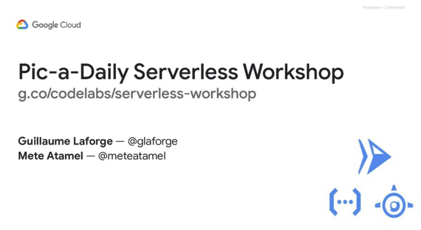

# Pic-a-daily

## Introduction

This is the code for the Pic-a-daily, an application to upload, analyse and
share pictures using Google Cloud serverless solutions, namely Cloud Functions,
App Engine, and Cloud Run.

## Labs

There is a workshop you can follow to build the app:

* [Lab 1 — Store and analyse pictures](https://codelabs.developers.google.com/codelabs/cloud-picadaily-lab1)
* [Lab 2 — Create thumbnails of big pictures](https://codelabs.developers.google.com/codelabs/cloud-picadaily-lab2)
* [Lab 3 — Run containers on a schedule](https://codelabs.developers.google.com/codelabs/cloud-picadaily-lab3)
* [Lab 4 — Create a web frontend](https://codelabs.developers.google.com/codelabs/cloud-picadaily-lab4)

## Presentation

There's a [presentation](https://speakerdeck.com/meteatamel/pic-a-daily-serverless-workshop) that accompanies the workshop.

## Architecture

At the end of the labs, this will be the final architecture:

## Solutions used

The app uses the following solutions:

Compute:

* [Cloud Functions](https://cloud.google.com/functions/) — functions as a service
* [App Engine](https://cloud.google.com/appengine/) — application as a service
* [Cloud Run](https://cloud.google.com/run/) — container as a service

Date:

* [Cloud Storage](https://cloud.google.com/storage/) — for storing file blobs (images)
* [Cloud Firestore](https://cloud.google.com/firestore/) — for structured data

Services:

* [Vision API](https://cloud.google.com/vision/) — to analyze pictures
* [Cloud Logging](https://cloud.google.com/logging/) — to track interesting events
* [Cloud Scheduler](https://cloud.google.com/scheduler/) — to run workloads on a schedule

-------

This is not an official Google product.
